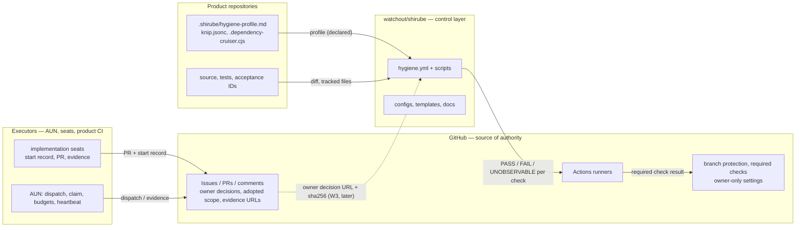

# Boundary — who is responsible for what (one diagram)

Internal requirement from handover v5 §12 (structure): one diagram of Shirube / GitHub / AUN and executors / product
repositories, with trust boundaries. The notation is a plain container diagram; the C4 notation itself is still a
candidate (baseline ADR, source confirmation pending), so this page claims no C4 compliance.

## Responsibilities and trust

| party | owns | must not |
|---|---|---|
| GitHub settings (owner) | branch protection, required checks, repository access, secrets | — |
| Shirube (this repo) | the checks, their configs and templates, the acceptance rows they implement | run, deliver, recover, remember; decide product behaviour; hold secrets |
| Executors (AUN / seats) | starting work only after the start record, producing evidence, finite budgets, heartbeat | self-review, self-merge, widening scope |
| Product repositories | the profile (what applies), entries and boundaries, acceptance IDs and tests | reading an old declaration as the current one (F5) |

Trust boundary: everything Shirube reads from a product repository is a declaration (profile) or a diff; Shirube verifies
declarations against observed facts where it can (baseline vs actual length, inventory vs scan, sha256 of the pinned
gitleaks binary) and reports UNOBSERVABLE rather than PASS when it cannot.
