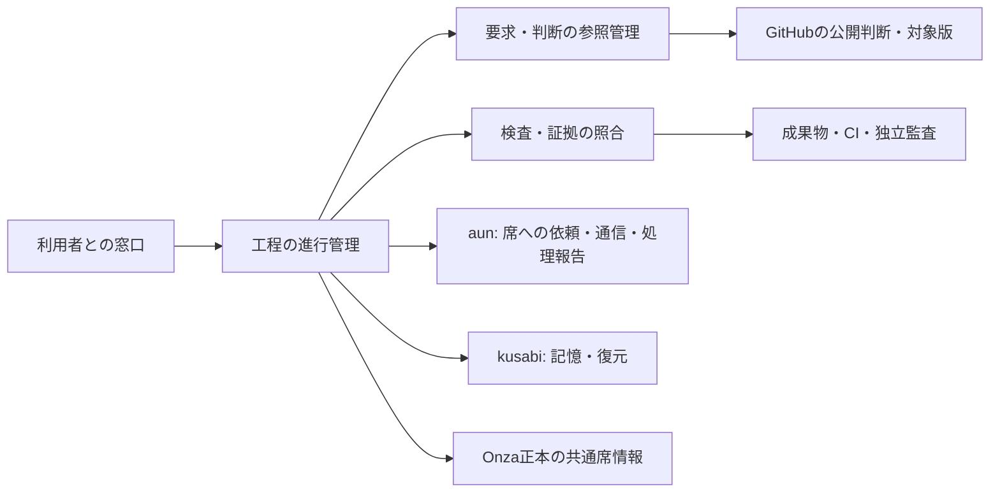

# Shirube初版 — 全体の責任境界と最初の実証の設計案

状態: **対話用の設計案 / 境界の選択は未採択 / 実装前**。作者: codex-adf。
入力: [Owner確認・独立要求監査済みの要求](../requirements/shirube-v1-p1.md) @ `b769909d44e044ee3570fce3a630d219b52cad23`。
要求本文SHA-256: `9a5b1bc530ae93133cb3d0197bce23edaad558ea00f7b664fb66cf6484ab1340`。
この文書の作成は実装、DB/CLI設定変更、既存席の起動、独立監査PASSの認可ではない。

## 1. 目的と今回の位置

Ownerの目的は「開発の高効率化自動化による高速開発化」。第一段階は「完成できることでいい」。
初版全体の要求を維持し、最初の実証対象として「要求・承認と作業開始の照合」が選択された（S1）。
自動引継ぎ、中断からの再開、独立監査、統合・実環境受入、追加修正の一周も全体設計に残す。

採択済み[AI-DLC手順§3〜5](../process/ai-dlc.md)を適用する。今回は全体の責任/データ境界と実証の設計質問を具体化する段階。
実装済みのW1検査と[旧境界](../boundary.md)を読み、新しい全工程要求との差分を明示する。
現在のShirubeは検査scripts・設定・雛形を持つ。`audit-admission.mjs`は監査返却を読む検査で、作業開始の認可や実行は行わない。

原典は[source lock](../sds/source-lock.json)のAI-01〜03を再取得し、bytes/hash一致を確認した。
- [AI-01 Domain Design](https://raw.githubusercontent.com/awslabs/aidlc-workflows/9b8df02231f0230fd6f19846a0df1fb5567e7ece/core/aidlc-common/stages/inception/domain-design.md): 論理部品、責任と情報の所有、相互作用、代替案を先に確認する。
- [AI-02 Units Generation](https://raw.githubusercontent.com/awslabs/aidlc-workflows/9b8df02231f0230fd6f19846a0df1fb5567e7ece/core/aidlc-common/stages/inception/units-generation.md): 依存と開発単位を対応づけ、実接続を通る小さな実証へつなぐ。
- [AI-03 Contract Design](https://raw.githubusercontent.com/awslabs/aidlc-workflows/9b8df02231f0230fd6f19846a0df1fb5567e7ece/core/aidlc-common/stages/inception/contract-design.md): 境界ごとに入出力、所有者、失敗時動作と互換性を定める。

ここでの日本語の部品名と試験案はShirubeへの適用案で、原典の命名ではない。
技術方式や配布単位を決める前の対話資料であり、原典の設計工程が完了したとはしない。

## 2. 確認する境界案 DQ-01

Shirubeの内部を次の3責務に分ける案。名称は説明用で、公開API名ではない。

| 論理部品 | 責任 | 所有する情報の案 | 外部との関係 |
|---|---|---|---|
| 要求・判断の参照管理 | 採択した要求/設計の版、公開判断と対象・範囲を対応づける | 要求版の参照、判断の参照と観測結果 | GitHubの公開本文/版を参照。人の判断そのものの正本はGitHub |
| 検査・証拠の照合 | 対象に必要な検査、実際の証拠、独立監査と対象版の一致を確認する | 対象/検査版に結びつく照合結果 | 既存W1検査、CI、独立監査の返却を利用。作者の自己評価を独立監査にしない |
| 工程の進行管理 | 要求・判断・証拠と工程条件を照合し、開始/差戻し/次担当/再開を管理する | 開発案件、工程の試行、条件判定、外部作業への参照 | 共通の席を参照。aunへ依頼し、その通信・処理報告を工程条件へ照合する |

判断参照と照合結果は、その元になる公開判断・成果物・実行記録への参照を持つ。
原文や証拠のコピーを独立した承認の正本にしない。承認をLLMが補作・推測して登録する経路を許可しない。
DBテーブル名、型、ID形式、同期/非同期、プロセス数はこの表では決めない。

矢印は必要な情報・機能の利用関係で、具体的な呼出プロトコルを選択した図ではない。
窓口は人へ説明・選択肢を示す。進行の許可をLLMの自己申告だけで確定しない。

| 境界の選択肢 | 利点 | 負担・変更への影響 |
|---|---|---|
| A: 上記の3責務を分ける（推奨案） | 公開判断の取得、検査の変更、工程の変更をそれぞれ照合・試験できる。既存checkerもその責任に合わせて接続できる | 部品間の入出力と責任を定める作業が必要 |
| B: 要求参照・検査・進行を一つの制御部品へまとめる | 最初の部品間契約を減らせる | 工程追加や検査更新が同じ部品へ集中するため、影響範囲と一体での試験を管理する必要がある |

いずれも同じ人の判断境界と受入条件を満たす必要がある。部品数だけで品質/速度の優劣を実測済みとしない。
推奨理由は責任・変更理由の違いと既存検査の再利用。単独利用、aun/kusabi連携、将来の上部管理層への参照を同じ工程規則へ結びやすい案として提示する。
**DQ-01の回答待ち**: AまたはB、あるいは責任の修正。選択前に最終の部品一覧やADRを採択済みにしない。

## 3. 他製品との所有境界

| 所有者 | 正本となる責任/情報 | Shirubeが扱うもの |
|---|---|---|
| GitHubの案件Issue/PR | 人が確認した要求・設計・判断、対象/有効範囲と証拠への公開参照 | 出所を確認した参照、読戻しと対象版の照合 |
| Onza共通仕様 | 共通の席/実行主体/接続情報の定義と更新権限 | 共通の席への参照、案件内の役割との対応。型/DDLを独自に再定義しない |
| aun | 席宛の通信、配送と処理の開始・完了報告、依頼から返答までの追跡 | 依頼の目的/範囲と指定先、aunの作業参照と観測された報告。品質/開発工程の完了判定はShirube側 |
| kusabi | 記憶・文脈の保存と復元、復元元/欠落の情報 | 復元した文脈とGitHub・実作業状態の照合。有効性を確認した後の工程再開 |
| 各担当・CI・独立監査 | 成果物、実行結果、監査の内容判断 | 必要条件と対象版に対応する証拠。受信・処理報告だけで実用上の完成にしない |

aunは既定branchのREADMEだけで判断せず、後続の工程記録S5/S6を読んだ。最新の作業記録では通信に加えて処理の開始・完了報告も追跡し、役割配置・業務工程・品質/承認の判断は外側に置く整理である。
その外側の開発工程をShirubeが担当する案とし、aunの処理状態をShirubeが別の書き手として直接更新する設計にしない。
S6時点のaun PR #5は文書作成中で実通信NOT_RUN。連携用の具体API・報告の真正性/順序/重複は、提供側と利用側の契約確認が必要である。

Shirube単独では工程・承認・監査の管理を提供する。aunを介する自動引継ぎと、kusabiを使う再説明不要の再開も初版全体の要求として保持する。
これらの実接続が未完の段階は、対応する連携受入をNOT_RUNとする。

## 4. 最初の実証で確認する開始条件の案

対象は「要求・承認と作業開始の照合」。親受入AC-02/03/06/08を中心に、AC-01/07/09/10へ結ぶ。
要求への同意だけを、未決の実装方式や任意の作業を開始する許可へ拡張しない。

1. 作業するrepo、対象版、作業範囲、担当の席、行う操作と環境を明らかにする。
2. 採択した要求・設計と、必要な人の判断/認可・独立監査を同じ対象へ結ぶ。
3. 公開判断の出所と有効範囲、現在の対象、必要な証拠を取得して照合する。失効・対象違い・欠落・取得不能は開始許可にしない。
4. 許可された操作だけが実際の開始処理へ届くよう、実行側との契約を設計する。照合結果を表示するだけで、開始を拒否できたとは判定しない。
5. 許可の記録と実際の開始を別に観測し、同じ作業へ対応づける。通信ACKだけで開始済みにしない。

どの操作直前で再照合するか、対象変更と同時に開始要求が来た場合の確定点、同一要求の再試行は契約で決める。
現時点で公式CLIのhookや任意シェル実行の制約を実証していないため、特定の接続方式で迂回を防止できるとは主張しない。
GitHub上の投稿者確認だけでは、人が会話でその回答をしたことの証明にならない。回答の取得元・対象版との対応・転記一致を検証する仕組みも実装前の設計対象である。

## 5. 実証シナリオ案（全件NOT_RUN）

| ケース | 前提/操作 | 観測する結果 | 親AC |
|---|---|---|---|
| ST-01 正常 | 必要な要求/設計/判断/証拠が対象に一致し有効な状態で開始を求める | 許可された範囲の作業が実際に開始し、その作業と照合結果が結びつく | 02,03,08,09 |
| ST-02 承認なし | 必要な人の判断が存在しない状態で同じ開始を求める | 対象作業は始まらず、必要な判断を一度だけ窓口へ示す | 02,06,08 |
| ST-03 対象違い | 別repo/版/操作/環境/席に対する承認を提示する | 対象外の開始を拒否。正しい承認の存在で別対象を通さない | 02,06,07 |
| ST-04 本文・出所不正 | 公開本文が参照digestと異なる、人の回答が確認できない、LLM自己申告しかない | 承認済みに変換せず開始を拒否。秘密や不要な会話を証拠へ露出させない | 02,06 |
| ST-05 失効・対象変更 | 許可の確認後に対象が変わる、承認が失効する条件を作る | 契約で定める開始時の確定点に対して古い許可を流用しない。競合の期待値を先に固定する | 02,06,07 |
| ST-06 取得不能 | GitHub/必要な証拠を取得できない | UNKNOWNを許可にせず停止理由を返す。復旧後は同じ対象を再照合する | 03,06,08 |
| ST-07 二重要求・応答喪失 | 同じ開始要求の再送、開始直後の応答喪失を発生させる | 実作業が二重に始まらず、未確認を区別して既存の作業と照合する | 06,07,08 |
| ST-08 必須証拠なし | 必須監査FAIL/UNKNOWN、古い版のCI、欠落した試験結果を入力する | LLMの「完了」や人の一般的な承認から免除を推測せず、開始を拒否する | 02,03,06 |

隔離した作業環境で、判定出力に加えて実行側の開始記録と対象への効果を観測する案。
拒否ケースでは対象操作による効果がないこと、正常ケースでは許可範囲だけが実行されたことを確認する。
正例を含まない「常に拒否」、判定の自己申告だけ、mockのみの成功は実用確認にしない。
Codex CLI/Claude Code、実GitHub、必要な接続の具体版、費用・実行回数、停止/復旧手順は実行前に固定する。
担当案: 作者が実装/試験証拠を作成し、作者以外が独立確認し、Ownerが実利用を受け入れる。未割当の担当は割当済みとしない。
観測期間は各実証の開始から終了/停止までとする案。速度向上の数値は採択せず、試行・人の判断待ち・再作業の実測を残す。

## 6. 全体要求との対応と、次の未決

| 親受入 | 提案した責務・今後の検証との対応 |
|---|---|
| AC-01 / AC-05 | 要求・判断の参照管理が固定正本を解決。製品ごとの導入値と共通規格を区別して検査する |
| AC-02 | 要求・判断の参照管理と工程の進行管理を接続。最初の実証で開始条件を確認 |
| AC-03 / AC-08 | 工程の進行管理が終了条件/次担当/停止/再開を扱い、aunの実開始と結ぶ |
| AC-04 / AC-06 | 検査・証拠の照合で既存検査を保持し、正負例と必要な拒否を確認する |
| AC-07 | 各変更の対象/影響と回帰・契約の証拠を照合し、進行条件へ結ぶ |
| AC-09 | 統合版と実環境の証拠、人の実利用受入を工程の完了条件へ結ぶ |
| AC-10 | 最初の実証後に別機能でも全工程を再現。第二の実証対象は未選択 |

対応表は責任の仮置きで、いずれのACも実証済みにしない。
DQ-01の境界確認後、部品の情報所有と相互作用を確定し、開発単位/依存と接続契約を具体化する。
実行方式・呼出形式・認証/認可・承認取得・変更/失効時の確定点・保存/復旧・第二の実証・担当/観測条件は未決。
未決に依存する実装は開始せず、判断材料を具体化して人へ戻す。全ての後工程の質問を今まとめて回答することは求めない。
次の設計案の独立監査には、全体の境界と最初の実証を同じ版で示す。現在は監査依頼前の対話段階。

## 7. 公開根拠

S1 — 最初の実証対象の選択 control_source_ref:
- url: https://github.com/watchout/shirube/issues/6#issuecomment-5963956582
- sha256: 450c138946de46ec83df4304c9655d05e3a90b818b89721235ae1943c902941d

S2 — 要求のOwner確認 control_source_ref:
- url: https://github.com/watchout/shirube/issues/6#issuecomment-5951754317
- sha256: 42b5774b1827e7a5a4571f8806d26f4e3684f68052f53398987ccb787bd0da99

S3 — 独立要求監査の受領（設計承認ではない）:
- url: https://github.com/watchout/shirube/issues/6#issuecomment-5952317059
- sha256: e4b89725304f0fc8a5fe36477fe24f7db3a0d480ccf9b2d9c13b581f1dd15f9d

S4 — 共通基盤の方針 control_source_ref:
- url: https://github.com/watchout/onza/issues/2#issuecomment-5941785917
- sha256: 0efd4a1ecc36794b53f3c79e99e7c3cb027055dbfcc563292088b185f75a596d

S5 — aunの共通基盤採用の公開記録（提供側の入力）:
- url: https://github.com/watchout/aun/issues/2#issuecomment-5948488183
- sha256: de5683a7993db3bcb6455b394c78deccaffffbad12727c96640ca172a5415fe1

S6 — aunの通信・処理報告の範囲と現在工程（提供側の作業記録）:
- url: https://github.com/watchout/aun/issues/3#issuecomment-5951984328
- sha256: a2b2ec4194e435f9cd87eaf71d539ad98440a30868898189749fb22a93106021

S7 — 適用する手順・監査方法の採択 control_source_ref:
- url: https://github.com/watchout/shirube/issues/6#issuecomment-5927903682
- sha256: 0623bba1351ec351c239790e1a76afddc0d04a19f5086b77a2f3eaa8495f53c6
