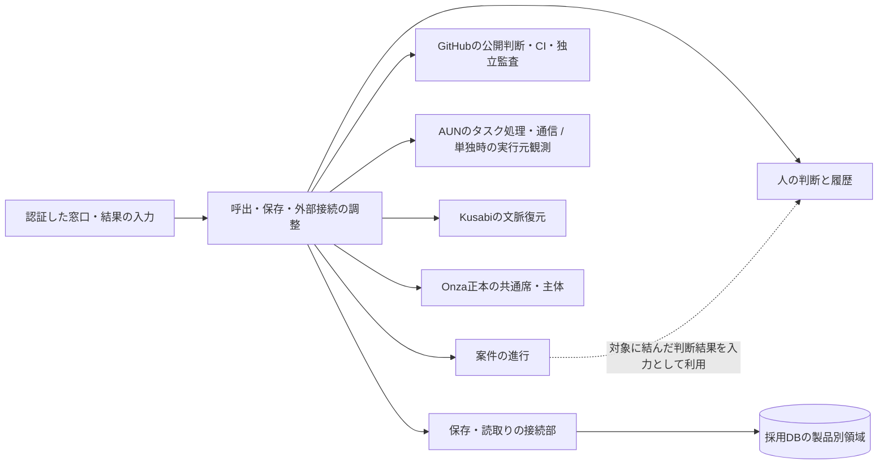

# Shirube初版 — 責任・データ境界の比較案

状態: **新SDS手順§3の対話用案 / 境界未採択 / 独立設計監査・実装前**。作者: codex-adf。
目的原文: 「開発の高効率化自動化による高速開発化」。第一段階: 「完成できることでいい」。
入力は[工程1の要求入口](../requirements/shirube-v1-p1-current.md) @ `e43f0580dce6bf0782af142df30f012d1b0b6364`。要求監査の受領は[工程設計](shirube-v1-workflow.md)冒頭を参照する。
作成指示のcontrol_source_ref:
- url: https://github.com/watchout/shirube/issues/6#issuecomment-5968467484
- sha256: 5fbb52466c97b3e363d5c24d3980b7608c3ae48764db72ce5e97743c1eb132da

## 1. 新SDSから今回の判断へ

[SDS手順§3](../process/ai-dlc.md)は責任・データ所有・依存と分割理由を先に示し、未所有/重複を解消する。[原典AI-01](https://github.com/awslabs/aidlc-workflows/blob/9b8df02231f0230fd6f19846a0df1fb5567e7ece/core/aidlc-common/stages/inception/domain-design.md) Steps 2〜4は、その境界の選択肢と影響を人へ提示し、確認後に部品一覧を確定する。
以下はこの判断の材料。二つの責任に分ける具体名・数は作者の案であり、AI-DLCの指定でも採択済みcomponent catalogueでもない。
業務上の部品と、担当席・Unit・PR・配布物・プロセスを区別する。DB、GitHub、外部MCP、保存/表示の接続部を新しい業務部品として数えない。
データは識別・所有・関係・項目の意味までを示す。物理型・制約・状態enum・保持期間・API・実行方式は後続の契約/詳細設計に残す。

既存実装は`configs/`と`scripts/hygiene/`の検査。`audit-admission.mjs`はGitHub/CI/独立監査返却を照合する読取り検査で、開始認可や工程遷移の実装ではない。
[既存W1境界](../boundary.md)はこの検査実装の説明として保持する。本案の工程/判断の機能が実装済みだとは扱わず、既存検査を同じ責任で再利用する。

## 2. 責任を分ける案と、その理由

| 論理上の担当 | 所有する判断・情報 | 分ける理由 |
|---|---|---|
| **案件の進行** | 適用SDS/要求/計画の版、工程の条件、担当、試行、承認の適用先、検査結果との対応、現在地・次の行動・全体受入 | 計画変更、実行結果、監査/受入で進行状態が変わる。工程の開始/完了を決める責任を一箇所にする |
| **人の判断と履歴** | 質問と提示版、本人回答、公開/読戻し、訂正/撤回/失効、当時の内容と出所 | 一つの判断は複数作業に使われ、作業開始前も終了後も残る。工程の状態変更が本人の回答内容や有効範囲を変更しない境界にする |

両者の呼出・保存・外部接続をつなぐアプリケーション処理は必要だが、第三の承認/進行ルールを持たせない。
検査の実行・結果照合には既存checker/CIを使い、独立した意味判断は作者以外の監査席が行う。別の「万能監査エンジン」は作らない。
履歴はそれぞれの所有者が残す。表示は同じ記録から生成し、別の進捗台帳・共通履歴サービスを新設する前提にしない。

実線は呼出の案、点線は意味上の入力依存。案件の進行は判断と証拠を使い、判断側は案件の状態を直接変更しない。進行と判断の依存を双方向の更新にしない。
外部結果は調整処理からその情報の所有者へ返す。保存部・表示部・接続部は許可/完了の意味を再定義せず、所有者の要求する版/権限/整合条件を満たして処理する。

## 3. 論理データと唯一の意味の更新者

下表の名称は比較用の概念名。共通IDの正式な型・発行者はOnzaを参照する。識別や項目をそのままテーブルとして実装する指示ではない。

| 記録 | 識別・主な項目 / 他の記録との関係 | 意味の更新責任 |
|---|---|---|
| 案件 | 案件参照、repo、採用SDS/要求版、計画参照、全体受入条件 | 案件の進行 |
| 計画版と作業定義 | 計画/作業参照、先行版、Unit/反復の対象範囲、依存、担当席/役割、入力・成果・終了条件、変更理由/判断参照 | 案件の進行 |
| 工程試行 | 工程試行参照、作業/計画版、対象版、元の試行、適用する判断、AUN等の実行元参照、待機/確認/差戻しの経緯 | 案件の進行。実行元のタスク/実行試行は所有しない |
| 工程で確認した証拠 | 照合記録参照、工程試行/受入条件、元証拠/検査版/対象版/発行元/観測時点、結果、無効化理由 | 案件の進行。元のCI/監査/実行結果は発行元が所有 |
| 判断要求 | 判断要求参照、対象と版/範囲、質問・選択肢、回答者条件、提示先、前提・有効性条件 | 人の判断と履歴。要求の内容/範囲は確認対象から受け取り、独自に拡張しない |
| 提示・回答・訂正の履歴 | 履歴参照、判断要求/提示版、本人の原文/選択、本人と代理記録者、出所、時点、前後/訂正/撤回の関係、照合結果 | 人の判断と履歴 |
| 公開・読戻しの記録 | 公開試行参照、対応する判断履歴、GitHub URL/本文digest、保存した当時の内容、観測時点、公開失敗/不明/不一致 | 人の判断と履歴。権限の正本はGitHub |

現在地は計画・工程試行・証拠から導く。独立して更新できる「進捗率」や「完成済み」台帳を増やさない。
判断をどの作業へ適用したかは工程試行の側が所有する。承認履歴の逆引きはこの参照を読む。同じ適用結果を判断側が別に書き直さない。
判断要求の対象は、その時点の案件/作業/成果物参照と版を固定して保持する。案件の改版で当時の提示内容を追随更新せず、必要なら後継の判断要求へ結ぶ。
必要な本文と履歴の保存、訂正、閲覧/削除権限はAH-01〜07を継承する。保存技術や無期限保持をこの概念表から採択しない。

## 4. AUN・Kusabi・Onzaとの境界

2026-10-03に[AUNの責任/データ案](https://github.com/watchout/aun/blob/9e54940496934171a243eaeafa2a584e86470a62/docs/design/responsibility-and-data.md)と[ADR-0004](https://github.com/watchout/aun/blob/9e54940496934171a243eaeafa2a584e86470a62/docs/adr/0004-work-and-delivery-boundaries.md)を読んだ。AUNは通信に加え、親依頼・タスク・実行試行・報告を扱う案へ進んでいる。両資料は未採択の設計案で、実接続や共通契約の完成を意味しない。
AUN入力の公開根拠: https://github.com/watchout/aun/issues/3#issuecomment-5967768822 / 本文SHA-256 `51d1a378e7740d3fbfd27a08dcf0c2e6371ec3b39647939fe12ad47cc36785f7`。
読取り資料のSHA-256: 責任/データ案 `284edcc804f4704670bd63863119a780d5532c5cafe01775d86b5c38b957d862`、ADR-0004 `330b00dd6c2572108b391bf5a90b7916b3ced88809f6ada3ee3506ecc7e6a532`。

| 対象 | 提供側が所有するもの | Shirubeで所有/変換するもの |
|---|---|---|
| GitHub | 公開判断、版付き成果物、CI/監査の公開証拠 | 対象版への参照と照合、判断の当時の写し。GitHub公開を保存だけで代用しない |
| AUN | 指定された親依頼/タスク/実行試行の処理状態、配送、再試行/回復・報告 | 開発上の作業/終了条件/役割の指定と、その実行元参照。返却を要求・設計・監査・受入条件と照合する |
| Kusabi | 文脈と出所の保存/検索/復元 | 復元した情報と現在の計画・判断・成果物の照合、どの工程を再開できるかの判断 |
| Onza共通仕様 | 席・主体・接続等の意味、共通型/更新権限 | 案件内の役割と共通参照の対応。cwdや表示名から主体/権限を作らない |
| Onza等の表示 | 所有者から取得した状態を表示する接続 | 初版CLIと同じ状態/版/鮮度を返す。表示側へ工程の合否・認可を移さない |

AUNの実行試行は「指示した仕事の実行」であり、Shirubeの工程試行は「その成果を開発工程の条件へ照合する範囲」。一つの工程に複数の実行が対応し得るため1対1に固定しない。
AUN接続時はそのタスク/実行試行/報告の参照と出所を保持し、処理完了を工程合格に変換しない。配送・provider実行・クレジット回復・同じタスクの再送をShirubeで別に制御しない。
監査指摘に基づく修正は、Shirubeが設計/範囲と必要な判断を確認して指定する新しい開発作業。配送失敗の再試行と区別し、実行の有無が不明な既存試行へ無条件に重ねない。
単独構成は、合意済みCLI/GitHubで工程・承認・監査を管理し、実行元の報告/証拠を照合する範囲。担当間の自動引継ぎはAUN接続で実証する初版要求として残す。単独時に汎用タスク実行器を複製しない。
単独時の入力・実開始・結果・拒否/復旧と方式比較は[単独実行の接続案](shirube-v1-standalone-execution.md)を参照。工程データにAUN IDを必須化せず、実行元の違いを接続部で変換する案。まだ方式の採択・実証ではない。
共通DBは[Onza採用版](https://github.com/watchout/onza/blob/5abd5d93952434228a6e2387b2714d19ec133a9a/docs/common/README.md)を参照。Shirube固有の記録は製品領域に置き、共通/他製品の行を直接更新しない。Onza UI停止と必須DB障害を区別する。

## 5. 最初の実証で責任がどうつながるか

以下はUnitを確定する前の相互作用案。最初の実証の範囲は既存のS1（[設計質問](shirube-v1-design-questions.md)§7）を維持する。

1. 案件の進行が要求/設計・対象・作業範囲・担当・終了条件から必要な判断を特定し、同じ対象版の判断要求を作るよう調整処理へ返す。
2. 人の判断と履歴が提示と本人回答を対応づけ、必要な照合・保存・GitHub公開/読戻しを経た事実を保持する。人の無回答や自動回答を承認に変えない。
3. 案件の進行が現在の対象/条件、判断、独立監査/CI等の証拠を照合する。条件が揃った作業だけ実行側へ渡し、既存判断内の作業に開始号令を追加しない。
4. 実行側との接続が、同じ対象/担当/実行参照に対する実開始の観測を返す。工程側に指示・実開始・結果を区別して結ぶ。AUN接続時は提供側の実行記録を参照する。
5. 作業の返却後、案件の進行が設計/試験/独立監査/受入の必要条件を確認する。必須失敗/不明は原因工程へ戻し、人の新しい判断が必要な場合だけ判断側へ新しい要求を渡す。
6. 照会では同じ計画・工程試行・承認・証拠から現在地と残条件を示す。人の承認履歴と、工程の確認結果・実利用受入を別に辿れる。

保存と公開/実行の部分成功、判断の撤回と実開始の競合は、責任を分けるだけでは解決しない。版をどう固定し、どこで再照合/失効し、効果を止めるかは手順§5/6の契約・実機試験で確定する。
現時点のcheckerは読取り検査である。本人性やCLIの迂回防止をこの呼出図から保証せず、未決に依存する開始処理は実装しない。

## 6. 確認済み要求への担当対応

要求の本文/受入条件は入力版を参照し、以下は所有と検証先だけを対応づける。各行を1試験へ固定しない。親自身の受入と横断条件を保持する。

| 要求 | 主な意味の所有者 / 外部との対応 |
|---|---|
| AC-01 | 案件の進行: 採用SDS/要求版を一意に参照。規格本文を案件へ複製しない |
| AC-02 | 案件の進行: scope/Done/証拠。人の判断と履歴: その対象版の確認/認可 |
| AC-03 | 案件の進行: 工程の入口/出口・証拠・次の行動 |
| AC-04 | 案件の進行: 既存hygiene/独立監査結果と必要な例外を照合 |
| AC-05 | 案件の進行: 採用規格版とrepo固有profileの参照・導入確認 |
| AC-06 | 案件の進行と人の判断と履歴: 正負の証拠、不明/未達の拒否。実行側の拒否は外部契約で実証 |
| AC-07 | 案件の進行: 変更前後の要求/契約/試験、判断側: 変更した意味の確認 |
| AC-08 | 案件の進行: 解除条件/次担当。AUN: タスクの実開始/処理。Kusabi: 文脈復元 |
| AC-09 | 案件の進行: 統合版と実環境・運用の受入。人の判断と履歴: 利用者の確認 |
| AC-10 | 案件の進行: 最初の実機能と別機能の全工程/親受入を同じ条件で追う |
| AH-01 | 人の判断と履歴: 提示/回答/公開。案件の進行: 適用作業/開始への対応 |
| AH-02 | 人の判断と履歴: 明示回答/条件/失敗/不正。案件の進行: 不正な判断では進めない |
| AH-03 | 人の判断と履歴: 訂正/撤回/後継と当時の内容。案件の進行: 古い許可の不適用 |
| AH-04 | 各所有者の重複/順序/主体履歴。共通席/実行元の現在版と当時の参照を区別 |
| AH-05 | 調整/保存/外部接続の部分成功を各所有者へ照合。二重実行と欠損を観測 |
| AH-06 | 両所有者の同じ記録を照会。任意Onza UI停止中も案件/判断/作業を逆引き |
| AH-07 | 各所有者の閲覧/出力/訂正の認可と保存/復旧契約。共通型の版はOnza正本 |
| WP-01 | 案件の進行: 計画版・順序・依存・担当・終了/利用条件 |
| WP-02 | 案件の進行: 実行元の観測と工程確認を対応。指示/終了報告だけで完了にしない |
| WP-03 | 案件の進行: 待機理由/次/解除/差戻し。AUNの処理待ちや再開と参照で結ぶ |
| WP-04 | 案件の進行: 手順版・観測・問題/成功・元試行と判断履歴への参照 |
| WP-05 | 両所有者の保存/読戻しと外部観測の同一性。時刻欠損・重複・並列を区別 |
| WP-06 | 案件の進行: 計画/見込み/実績/残条件。表示部はその意味を変更しない |

次段階WP-07/08は、上記記録を使う詳細表示・改善の検証/共有として残す。新たな分析部品、モデル再学習、手順の自動書換えを初版の部品へ加えない。

## 7. 境界案の確認方法と代替

| 確認する場面 | この案が守るべきこと / 後続の実証 |
|---|---|
| AUNがタスクの処理完了を返すが監査は不合格 | AUNの実行記録を変更せず、Shirubeの工程は未完。必要な修正先/再監査を示す |
| 工程完了後に当時の承認を照会 | 終了/改版で本人回答や当時の内容を消さず、現在の許可と区別して逆引きできる |
| 承認が撤回された直後に開始要求 | 最新の対象/判断を照合し、採択する競合契約に従って拒否。保存履歴だけで開始しない |
| 再送・再起動・担当交代 | 同じ実行元参照と工程試行を照合し、二重開始・二重計上・作者履歴の消失を防ぐ |
| 単独構成、AUN/Kusabi接続、Onza UI停止 | それぞれの提供範囲を維持し、未接続機能を成功扱いしない。AUN等の代替実装を増やさない |

この表は境界の評価条件で、実行結果は全件NOT_RUN。工程3は責任/所有/依存を確認して出口条件を満たしたかを判定し、実装・実環境の完成とは分ける。現在は比較案の選択前であり、工程3の確認済み完了とも扱わない。

| 選択肢 | 利点 / 負担・注意 |
|---|---|
| A: 案件の進行と人の判断/履歴に責任を分ける（推奨） | 計画/工程の頻繁な変更と本人回答/公開履歴の保全を分けられる。開始時の対象/判断の整合を境界契約として実装・試験する必要がある |
| B: 両方を一つの案件管理部品で所有する | 内部の呼出境界は少ない。一方、案件外にも残る判断履歴・複数作業への適用と工程変更が同じ所有範囲になり、変更/認可の影響を広く確認する必要がある |

推奨の根拠は、AH要求の長く残る本人判断と、AC/WP要求の改訂・差戻しを繰り返す工程が、異なる理由/時点で変化すること。部品数を減らすこと自体を目的にしない。
今回人が選ぶのはこの**意味とデータの更新責任の境界**。同一アプリで実装できる論理案であり、別サービス・別DBを導入する判断や、二つのUnitにする判断ではない。
確認後にこの境界を採択記録/部品一覧へ反映し、手順§4で要求・依存・接続・担当・受入・配布形態からUnit/反復を具体化する。未定の型/API/本人性/開始拒否・部分失敗/復旧は§5/6へ残す。
