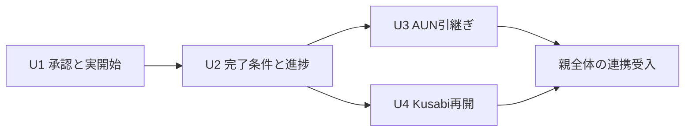

# Shirube初版 — Unitと最初の反復の計画

状態: **Unitの基本方針・U1/U2先行をOwner確認済み / 共通部の横断設計をARCへ依頼 / 必要な独立設計監査・実装前**。作者: codex-adf。2026-10-05。
目的原文: 「開発の高効率化自動化による高速開発化」。第一段階: 「完成できることでいい」。
入力: [要求の入口](../requirements/shirube-v1-p1-current.md) @ `e43f0580dce6bf0782af142df30f012d1b0b6364`と[採択した責任分担](shirube-v1-responsibility-and-data.md) @ `1526db06504fcae34af5d923f935accc79c3508f`。
責任分担のcontrol_source_ref: https://github.com/watchout/shirube/issues/6#issuecomment-5985239100 / SHA-256 `9a6ac74e861addd4faa62177de95e9fcfa7728724652886c5b64412c7632d08d`。
最初の実証「要求・承認と作業開始の照合」のcontrol_source_ref: https://github.com/watchout/shirube/issues/6#issuecomment-5963956582 / SHA-256 `450c138946de46ec83df4304c9655d05e3a90b818b89721235ae1943c902941d`。
要求監査の受領は[工程設計](shirube-v1-workflow.md)冒頭を参照。要求本文内の当時の未監査表示を、新しい要求監査結果に置き換えるためだけには改版しない。
今回のcontrol_source_ref: https://github.com/watchout/shirube/issues/6#issuecomment-5985512523 / SHA-256 `052df99fc9b501b14a38d6ab4ce26103c9ac0f97fc259a08b7f45ef719d3fd54`。Ownerは基本方針を確認し、MCP共通部＋最小の製品アダプタをARCで判断・設計、U1/U2は監査合格後の着手と指示。具体方式やU3/U4の順序まで採択したとはしない。
横断設計の依頼: [ARC #57](https://github.com/watchout/iyasaka-arc/issues/57)。共通仕様の正本はOnzaのまま。Issue作成をARCの受諾・着手と扱わない。

## 1. 原典からの導出と今回の範囲

Unitは責任/成果がまとまった開発単位。Boltはその実装・検証を進め、動く結果を確かめる短い反復。内部部品、席、PR、配布物の個数とは別に扱う。
[AI-02 Units Generation](https://github.com/awslabs/aidlc-workflows/blob/9b8df02231f0230fd6f19846a0df1fb5567e7ece/core/aidlc-common/stages/inception/units-generation.md) Steps 1〜5は、確認した責任と要求からUnit・依存・接続を提案し、人の選択後に確定する。最初のUnitは後続を待たず実接続を通して動く範囲にする。
[AI-04 Delivery Planning](https://github.com/awslabs/aidlc-workflows/blob/9b8df02231f0230fd6f19846a0df1fb5567e7ece/core/aidlc-common/stages/inception/delivery-planning.md) Steps 2〜5は、依存関係から実施可能な順序を確認し、その中の優先順位・反復の成果・担当を決める。依存がないことだけで経済的な優先順位は決まらない。
両原典は[source lock](../sds/source-lock.json)のbytes/hashと再照合済み。[採択済みSDS手順§4〜8](../process/ai-dlc.md)に従って以下へ集約する。専用engine、固定席編成、原典実装の帳票一式は導入しない。
この計画の完了条件は、Unitの範囲・依存・受入・接続・担当・配布案と、最初の反復の実演/残条件を人が判断できること。基本方針の確認後は§6の契約/設計と監査へ進む。下表の割当は実証PASSでも正式契約でもない。

## 2. Unit — 動く利用範囲で分ける

二つの内部責任を別々に完成させる分割にはしない。各Unitは必要な責任の実装を追加するが、判断の履歴は判断側、工程の状態は進行側という更新責任を保持する。
全Unitを同じShirubeの配布へ組み込む案とし、Unitごとに別サービス/DBを増やさない。提供側MCPは別製品のまま。具体的なCLI/プロセス/パッケージ/起動方式は契約・詳細設計で選ぶ。

| Unit / 安定した仮ID | 利用できるようにすること | 実装範囲と境界 | 完了を観測する条件 |
|---|---|---|---|
| **U1 承認に沿った作業開始** / `u1-authorized-start` | 要求・判断を同じ対象へ結び、許可された作業を開始できる | 両責任の必要部分、GitHub公開/読戻し、共通席参照、実DBの履歴、CLIの開始/結果接続、最初の工程/試行と現在地。AUN/Kusabiは不要 | 実CLIで正常開始、未承認/失効/別対象/必須不合格の拒否、重複・応答喪失の照合、当時の判断と作業の逆引きを実演する |
| **U2 完了条件と進捗をつなぐ** / `u2-workflow-completion` | 結果を確認し、現在地・詰まり・残条件を示して案件を完了まで進める | U1を再利用し、計画改訂・設計/実装/試験/監査/統合/受入の状態、差戻しと次の作業、手順/問題/成功の記録を拡張。表示用の別台帳は作らない | 不合格/未受入を未完と示し、是正後の証拠で進む。不要な開始号令なく同じ実行先で進行し、一つの機能を実環境受入まで追える |
| **U3 AUNによる担当間の引継ぎ** / `u3-aun-handoff` | 許可済みの次作業を別の担当へ自動で引き継ぐ | U1/U2の条件をAUNのタスク/実行参照へ接続。通信・配送・provider実行管理はAUNを利用し、Shirubeで複製しない | 送信/受領/実開始/結果/工程合格を区別し、人の伝言なしで別担当が開始。断線・重複でも二重実行やローカルへの自動代替起動がない |
| **U4 Kusabiを使う中断からの再開** / `u4-kusabi-resume` | 経緯を説明し直さず、現在の有効条件から作業を再開する | 文脈はKusabiから取得。Shirubeが現在の計画/判断/成果/実行参照と照合し再開を判断。記憶保存/検索を再実装しない | 変更・撤回・完了済み・文脈欠落を区別。古い承認の復活や完了済み作業の再実行がなく、単独/AUN接続双方の再開を確認する |

U1は小さな範囲でも、本人性・履歴保存・拒否・復旧を後続Unitへ先送りして安全な開始を主張しない。U2を待たず、対象作業の実開始/結果/履歴を照会できる必要がある。
U2の「案件を完了まで」は単独提供範囲での工程管理。別担当への自動配送はU3、再説明不要の文脈復元はU4へ結ぶ。作者と独立監査者を同一主体へまとめない。
U4のKusabi復元と、U1/U2自身の障害回復を区別する。Shirubeのデータ保存/復旧や二重実行対策をU4まで延期しない。

## 3. 依存と接続（優先順位とは別）

矢印は先行する機能からそれを利用する機能への向き。U3とU4の間に必須の開発依存はない。両方を使う横断受入には両者が必要。



同じUnit間依存を確認する機械可読表（実行設定ではなく、外部契約の準備状況は含まない）:

```json
{"units":[{"id":"U1","depends_on":[]},{"id":"U2","depends_on":["U1"]},{"id":"U3","depends_on":["U2"]},{"id":"U4","depends_on":["U2"]}]}
```

| 接続 / 契約の所有者 | 利用するUnit / 必要な合意 |
|---|---|
| 判断・履歴と工程の内部接続 / Shirube | U1で対象/版/有効範囲/保存・公開・開始の確定点を定義。U2〜U4は同じ意味を再利用し、別の承認ルールを作らない |
| 窓口・実CLIとの接続 / Shirube側とhost側 | U1で本人回答の取得、開始直前の拒否、実行範囲、報告の真正性・重複・停止/照会を実接続で確認。接続方式は未選定 |
| 共通席・主体・実DB / Onza共通仕様、Shirube製品データ | U1で採用型/更新権限と履歴の保存/復旧を確定。U2以降は互換性と既存履歴を保持。共通の定義をShirubeで再発行しない |
| GitHub / CI / 独立監査 / 各発行元とShirube受領 | U1で対象と出所、U2で全工程の条件へ対応。既存checkerを再利用。引用/形式の一致だけを内容の合格にしない |
| AUN / 提供側の通信・作業契約 | U3で対象・席・実行参照、報告順序、失敗時の照会/再送責任を合意。未実装/未確認の提供側を接続済みにしない |
| Kusabi / 提供側の保存・復元契約 | U4で文脈の版/出所/欠落と現在状態への照合を合意。U3と独立でも進められるが、併用時の受入は別途必要 |

外部の提供状況・契約版は各Unitの詳細設計開始時に読み直す。現時点で具体API/型/実通信の採用確認は未完であり、日数や外部席の着手を仮定しない。
U1の`depends_on: []`は先行するShirube Unitがない意味で、共通契約が不要という意味ではない。U1/U2の共通参照・本人性・保存にもARC #57の先行返却が必要。AUN/Kusabiの実接続完成と、この必須契約の確定を別に扱う。

共通部は同じ意味と振る舞いを複数製品で使う部分へ絞り、製品の業務判断は各製品へ残す。Shirubeのローカル実行/AUN接続で工程判定を分岐させず、共通契約と固有変換を使う。共通化候補の実装場所・配布方式・認証はARCの比較/設計で明示し、未採択の選択を作者が補わない。
[Onza共通仕様 @5abd5d9](https://github.com/watchout/onza/blob/5abd5d93952434228a6e2387b2714d19ec133a9a/docs/common/README.md)を正本とし、[AUNの必要契約 @47d4109](https://github.com/watchout/aun/blob/47d41095b13c46ea8a6589cd97aa7c491e1d1fbe/docs/design/common-contract-request.md)も横断設計の入力へ結んだ。既存Kusabi/Kodamaの全面改修や旧SQLite移行は今回の指示から追加しない。

## 4. 初版要求への対応

原文は入力要求を正本とする。下表はUnitへの割当で、要求を一つの試験へ固定したり、親自身の受入をUnitの合計で代用したりしない。
U1の限定実証で確認した部分と、その後の適用範囲での再検証を区別する。全採択IDについて必要な証拠が揃うまで初版未完。

| 要求 | 実装/検証するUnitと親での確認 |
|---|---|
| AC-01 | U1: 採用SDS/要求/判断の正本参照。U2: 改版。親: 正本と導入版の一意性 |
| AC-02 | U1: 目的/範囲/判断/実開始の対応。U2〜U4: 各追加範囲の設計・証拠へ接続 |
| AC-03 | U1: 開始/拒否と試行。U2: 全工程の入口/出口。U3/U4: 引継ぎ/再開も同じ条件 |
| AC-04 | 全Unit: 既存hygiene・責任/依存境界を維持し、新しい重複/肥大化を検査 |
| AC-05 | U1: 規格の固定参照と初回導入。U2〜U4: 導入条件の差分。親: 他repoのprofileで再現 |
| AC-06 | U1: 開始拒否の正負例。U2: 不合格/不明で未完。U3/U4: 同じ拒否条件が接続先でも有効 |
| AC-07 | 全Unit: 追加前後の契約/回帰/既存データ。親: 統合状態と導入先の保持 |
| AC-08 | U1/U2: 待ち先/解除/次作業。U3: 別担当の実開始。U4: 有効性照合後の再開 |
| AC-09 | U2: 全工程と実環境の条件。全Unitと親: 必要な結合・統合版・復旧・実利用受入 |
| AC-10 | U1/U2: 最初の実機能の一周。U3/U4と親: 連携受入、別機能でも一周と追加/修正の再現 |
| AH-01 | U1: 提示/回答/公開/作業開始の追跡。U2〜U4: 結果・変更・引継ぎ/再開から同じ履歴へ逆引き |
| AH-02 | U1: 明示回答/条件/無回答/失効の区別と拒否。U2〜U4: 後続工程でも保持 |
| AH-03 | U1: 訂正/撤回/後継と当時の内容。U2/U4: 計画変更・復元で古い許可を復活させない |
| AH-04 | U1: 並列/遅着/重複/主体交代。U3/U4: 外部接続の実行参照/世代と照合 |
| AH-05 | U1: 保存/公開/開始の部分成功と回復。U2〜U4: 追加した操作でも欠損/二重実行を確認 |
| AH-06 | U1: Onza UIなしの保存/照会。U2: 工程から逆引き。U3/U4: 再起動/連携後も同じ履歴 |
| AH-07 | U1: 閲覧/出力/訂正の権限、移行、backup/restore。U2〜U4: 拡張時の互換性/復旧 |
| WP-01 | U1: 最初の計画/作業の版・担当・終了条件。U2: 全工程・改訂・依存。U3/U4: 接続を反映 |
| WP-02 | U1: 実開始/終了報告/確認の区別。U2: 監査/実受入。U3/U4: 実行元・再開元の証拠 |
| WP-03 | U1: 人待ち/外部不明時の停止。U2: 差戻し/次作業。U3/U4: 引継ぎ/復元失敗と解除 |
| WP-04 | U1から: 手順版・観測・作業/判断の参照。U2: 全工程の問題/成功と元試行。U3/U4: 連携範囲 |
| WP-05 | U1: 重複/時刻欠損/再起動/Onza UI停止。U2: 並列・区間・計画改訂。U3/U4: 遅着/復元 |
| WP-06 | U1: 今回の完了/未完と残条件。U2: 当初計画/見込み/実績と利用可能条件。親: 分母を縮めない |

WP-07/08（詳細可視化・検証/共有するPDCA）は次段階のまま。上部のrepo横断管理、別窓口の実導入、旧破綻案件の救済を初版へ追加しない。

## 5. 実施順と反復の提案

先行する **U1 → U2** は必要な監査合格後に着手する方針をOwner確認済み。最初の対象は既存のOwner判断を保持し、その後は単独で完了まで追える価値を先に確認する。後半の **U3 → U4** は担当間の待ちを減らす引継ぎ、文脈復元の順という作者の推奨で、ARCの接続設計も入力にする。後半の優先順位は未確定。
U3/U4は技術上は順序交換できる。提供側の準備で遅れる場合も、依存がないことを根拠に価値の優先順位を黙って変更せず、影響と代替順を示す。新しい席/並列subagentの起動は計画に含めない。

| 反復案 | 作る/確かめる成果 | 次へ渡す条件 |
|---|---|---|
| B1 / U1の最初の実動作 | 一つのrepo・対象作業で、CLIの人の回答→GitHub公開/照合→実DB保存→実開始/結果→履歴/現在地の照会を通す。既存ST-01〜08の該当条件を実行 | 対象を限定しても必須の拒否/整合/履歴を外さない。最初の実演が何を証明し何をまだ証明しないかを提示する |
| U1の残る適合確認 | 同じ開始・履歴契約をCodex CLI/Claude Codeで確認し、並列/再起動/保存復旧・導入条件まで受入へ結ぶ | U1の全完了条件を満たす。B1と同時に確認できた証拠は再利用し、同じ試験を形式だけで繰り返さない |
| U2の反復 | 同じ作業結果から条件を照合し、正常な次工程・監査不合格の差戻し・実受入待ちを工程表へ示す | 最初の実機能の要求から実環境受入までを閉じる。コード終了報告を受入済みにしない |
| U3/U4の反復と親受入 | 各接続の実動作と組合せ、別機能での一周、追加/修正の既存回帰を確認する | 初版23 IDと親全体の条件を満たす。未接続、mockだけ、未実施の受入を残して初版完成にしない |

Bolt数/日数は未見積。B1で先に使うCLIと具体操作/費用/回数は契約・試験準備で固定する。初版両CLIへの対応は減らさない。UnitとBoltを1対1に固定せず、設計後の作業量に応じて短く分ける。
第二の実機能は未選定。U2以降の見通しには条件を残し、選定がなくても今の設計を進められる部分を進めるが、AC-10の受入前に対象/観測を確定する。

## 6. B1をコードへ進めるための設計・観測

選んだUnitごとに必要な詳細設計と要求由来の試験を一緒に作る。毎Unitへ固定7工程や別の設計帳票を追加する規定ではない。共通設計/証拠は対象版の有効性を確認して再利用する。

| B1で具体化するもの | 実装と同時に用意する観測 / 未実施の状態 |
|---|---|
| 本人回答から公開判断までの接続 | 認証した本人・提示版・回答・公開本文の対応。LLMの代筆/自動回答を承認にしない正負例。方式未選定 |
| 開始直前の拒否と権限境界 | 許可対象の実効果と、未承認/別対象/失効の効果0。hook故障・別tool・直接起動の迂回も管理対象で観測。表示だけの拒否は不合格。方式未選定 |
| 保存/公開/実開始の整合 | 再送・撤回競合・応答喪失の順序、実行一意性、照会/復旧。時点/確定点と具体型/APIは未選定 |
| 実行と結果の観測 | CLIイベント/終了と実対象/試験を対応づける。開始予定・実開始・返却・工程確認を区別。欠損は不明のまま残す |
| 記録と導入/回復 | 実PostgreSQLへ保存し、再読込み・閲覧権限・backup/restore・既存検査回帰を確認。共通型・製品DDL・保持/削除は未選定 |

試験の入口となるコマンド/fixtureは上の観測を実行できる実装と共に作る。現在の`npm test`は既存検査の回帰で、新しい工程機能の実動作を検査しない。未作成のコマンドを実行済みとは書かない。
既存[ST-01〜08](shirube-v1-design-questions.md)と[単独/連携の観測条件](shirube-v1-standalone-execution.md)を試験入力へ落とし、改版した対象と実行環境/発行元へ証拠を結ぶ。各期待値は要求から定め、実装の出力に合わせて変更しない。
同じ要求/判断/証拠ならAUN有無によらず同じ工程判定になる条件はU3で実接続比較する。U1の単独成功でAUN側も成功したとは扱わない。

### 6.1 U1/U2の設計・監査へ渡す範囲

新SDS §5/6に従い、必要な提供/利用契約と詳細設計を固定した版へまとめて監査する。Unit計画だけのPASSで実装可能とはしない。以下は既存の未決と試験入力の対応で、新しい独立帳票や共通APIの定義ではない。

| 対象 | Shirube側で具体化する設計/試験 | 先に必要な共通返却 / 依存する着手 |
|---|---|---|
| U1: 判断から開始 | 提示版/本人回答/公開本文の対応、対象/版/有効範囲、撤回と開始の競合をST-01〜08へ結ぶ。自己申告・別対象・失効を拒否し、許可範囲の実効果と対にする | 主体/席/bindingの型、本人認証と現在認可/失効。これが未確定の認証接続・開始認可実装は保留 |
| U1: 保存と実行 | 保存/公開/実開始の確定点、再送・不明・照会/回復、当時の履歴をAH-01〜07/WP-02/05へ結ぶ。U4を待たず復旧を確認 | 共通参照とDB権限・導入/更新/復旧。共通DDLや接続部を独自定義して実DB試験へ進めない。CLIの実効権限境界も詳細設計が必要 |
| U2: 条件照合と進行 | 採択した要求/計画版・工程試行・証拠を結び、不合格/不明/実受入待ちと次の作業を区別。AC-03/06/08/09、WP-01〜06を正常/差戻し/計画改訂へ対応 | U1の契約を再利用。状態・証拠・残条件の論理設計は共通の物理型を仮定せず進められる。具体実装は対象設計の監査後 |
| 共通部/アダプタ | 同じ契約版で提供側適合・利用側期待・結合を対応。正常だけでなく旧主体/重複/版不一致/依存停止も残す | ARC #57で最小共通部と変換責任を確定。U3/U4の全実装を先行条件にせず、U1/U2が使う部分から返却/監査 |

監査入力は対象PR/head/base、採択した判断/要求/契約、対象別の固定項目、作者と独立監査席、必要なCI/試験の出所へ結ぶ。設計監査のD1〜D6を今回の境界・契約・未決へ対応させ、実装監査/実環境受入は対象ができた時に同じ要求を使う。設計の未決を監査者の推測やチェック項目削減で埋めない。
現在は共通の詳細契約・Shirube詳細設計が未完で、実装着手を判定する独立設計監査は未依頼。要求監査や既存CIのPASSはその代用にならない。対象設計/契約が揃い独立監査を通過した範囲は、追加の開始号令なく実装・試験へ進む。

## 7. 担当・監査・完了の扱い

設計/実装/作者試験の担当は現担当codex-adf。独立監査は既存監査席へGitHubの固定対象を渡す方式を維持し、今回まだ依頼していない。merge担当は作者と別、実利用受入はOwner。提供側の作業や監査席の着手を割当済みとはしない。
[監査方法](../sds/audit-method.md)に従い、境界・Unit・対象反復の契約/設計を同じ対象版へ結ぶ。実装前に必要な独立設計監査を受け、実装後は要求/設計との一致と試験の検出力を確認する。固定項目＋機械照合＋独立判断を使い、要求監査PASSを設計/コードへ流用しない。
Unit完了は対象の設計・実装・試験・必要な独立監査・採用配布方式での統合/受入が揃った時。親全体の受入や実運用再現性は別に残る。別担当によるmain統合と、その統合版の実試験を確認する。
現在はUnit基本方針とU1/U2先行の条件をOwner確認し、共通設計をARCへ依頼した段階。Unit/Bolt/全体の実装・実機試験・受入は全件NOT_RUN。CIは文書と既存検査の回帰だけを示す。

## 8. 比較と今回の選択

| 案 | 利点 / 負担 |
|---|---|
| 動く範囲で上記4 Unitに分ける（推奨） | 最初の開始照合を実際に使える単位にし、進行全体と任意接続を後から確認できる。同じ内部部品を後続が拡張するので契約/回帰を維持する必要がある |
| 内部責任ごとに2 Unitへ分ける | 責任とUnitが一致する一方、判断だけ・工程だけでは最初の実証が成立せず、初回に両方の結合が必要になる。内部責任の採択からこの分割は導けない |
| 初版全体を1 Unitにまとめる | Unit間の区切りは少ない。一方、単独・全工程・外部接続までの未完が一つに集まり、局所の利用可能範囲を別途反復で追う必要がある |

Ownerは4 Unitの基本方針とU1/U2先行を確認し、共通部＋製品別最小アダプタのARC判断/設計と監査後着手を求めた。最初の実証対象や二つの内部責任、U1/U2の開始方針を再質問しない。未選定の技術を比較・契約化して独立監査へ進む。
新しい結果を変える判断が生じない通常の具体化には、工程ごとの開始指示を追加しない。未合意の接続方式・認可・範囲を、この計画の採択だけで決定しない。
